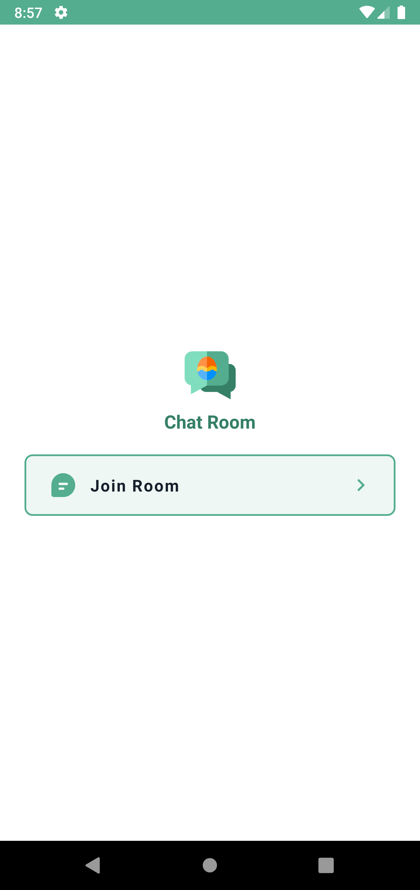
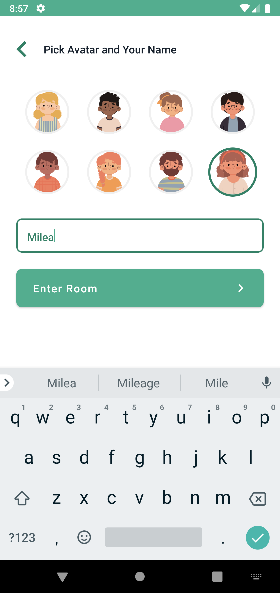
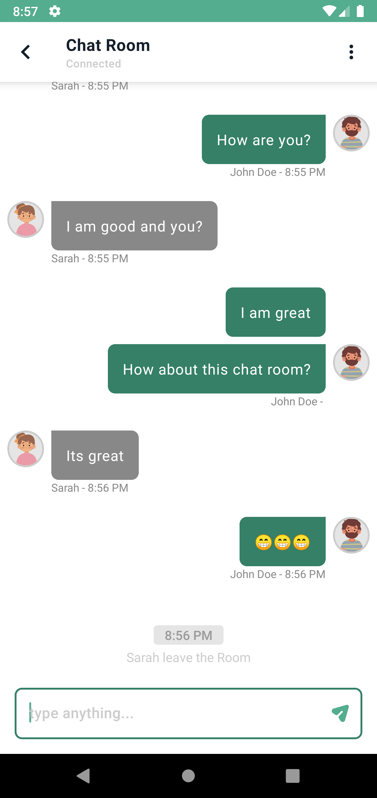

# Chat Room App

The simple chat room application with multiple user in realtime message delivery.
The chat network connection in this app using MQTT Server Broker from [HiveMQ](https://www.hivemq.com/),
with [Gojek Courier](https://github.com/gojek/courier-android) client library using Coroutine Flows. 
The application stack using MVVM Design Pattern + Hilt Dependency Injection + Jetpack Compose.

  